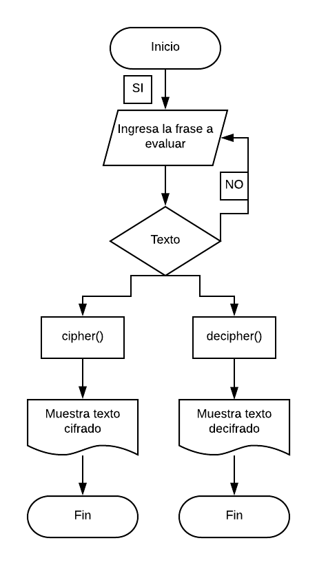

# CIFRADO CESAR
### Descripión:

Crea una web que pida, una entrada por medio de un prompt(), una frase al usuario y devuelva el mismo mensaje encriptado según el algoritmo de Cifrado César con el parámetro de desplazamiento de 33 espacios hacia la derecha.

Por ejemplo:

Texto original: ABCDEFGHIJKLMNOPQRSTUVWXYZ
Texto codificado: HIJKLMNOPQRSTUVWXYZABCDEFG

### Consideraciones Específicas:

* Tu programa debe ser capaz de cifrar y descifrar tanto letras mayúsculas como minúsculas. La fórmula para descifrar es: (x - n) % 26.
* Tu código debe estar compuesto por 2 funciones con los siguientes nombres: cipher() y decipher().
* El usuario no debe poder ingresar un campo vacío o que contenga números.

## Pseudocódigo:

### Descripción:
El Pseudocodigo me sirve para detallar a grandes razgos los pasos fundamentales de tu codigo a ejecutar.

1.- Pedir una frase al usuario mediante un prompt().

2.- Validar que la frase ingresada solo tenga letras, que no sea una cadena vacia y que no tenga numeros.

3.- Identificar las letras mayusculas y minusculas de la frase.

4.- Cifrar la frase.

5.- Descifrar la frase.

6.- Mostrar el resultado.

## Diagrama de flujo.

Es la secuencia grafica de nuestro Pseudocodigo.

